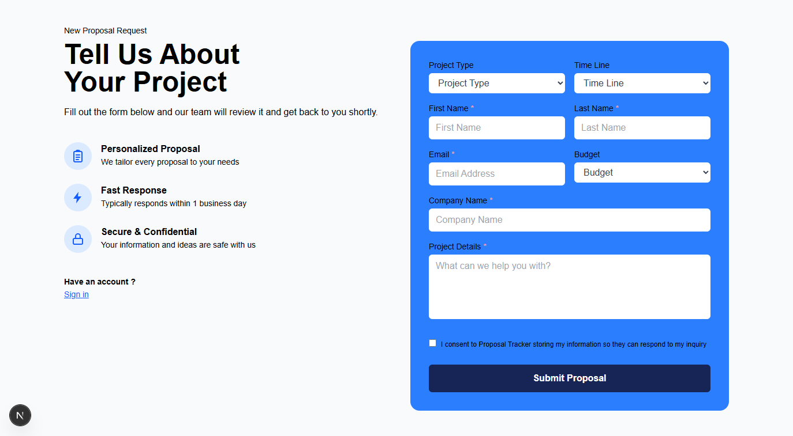

# Proposal Tracker

Internal tool for capturing inbound project inquiries, generating branded PDF proposals, and managing won deals on a kanban board.



## Team Members:
- Nicole Cespedes
- Jonathan Hubbard
- Troy Wenzel 
- Thomas Lappas
- Charlie Estrada
    
## Tech Stack: 
Python + Flask, TypeScript + Next.js

## Getting Started

**Requires:** Python 3.13 and Node 22 (Next.js 16 needs Node 20+).

### Backend

```bash
cd backend
python -m venv venv
venv\Scripts\activate          # macOS/Linux: source venv/bin/activate
pip install -r requirements.txt

copy .env.example .env         # macOS/Linux: cp .env.example .env
python -c "import secrets; print(secrets.token_hex(32))"
# paste that value into SECRET_KEY= in .env

python seed.py                 # optional: demo client, proposals, messages, files
python run.py                  # http://localhost:5000
```
### Frontend

```
cd frontend
npm install
npm run dev                    # http://localhost:3000
```

## Project Structure:
```
Proposal-Tracker/
├── .gitignore
├── README.md
│
├── backend/                            Flask REST API (JSON only, no templates)
│   ├── run.py                          Dev entry point — starts the Flask server
│   ├── seed.py                         Demo data: sample client, proposals, messages, files
│   ├── requirements.txt                Python dependencies
│   ├── .env.example                    Environment variable template (copy to backend/.env)
│   ├── proposal_tracker.db             Dev SQLite database (gitignored, created on first run)
│   ├── uploads/                        Uploaded files on disk (gitignored, served via API only)
│   └── app/
│       ├── __init__.py                 App factory — config, extensions, blueprints, error handlers
│       ├── config.py                   Environment-based settings (DB, CORS origin, upload limits)
│       ├── extensions.py               Flask extension instances (CORS, Marshmallow)
│       ├── models.py                   SQLAlchemy models — Users, Submissions, Proposals,
│       │                               Projects, Templates, Settings, notes/messages/files
│       ├── blueprints/                 Route handlers, one package per audience
│       │   ├── users/                  Register and login — issues the JWT
│       │   │   ├── routes.py
│       │   │   └── schemas.py
│       │   ├── submissions/            Public intake form submission + lookup
│       │   │   ├── routes.py
│       │   │   └── schemas.py
│       │   ├── portal/                 Client-facing API — own proposals, messages,
│       │   │   ├── routes.py           file upload/download, profile, display settings
│       │   │   └── schemas.py
│       │   └── team/                   Internal API — proposal manager, notes, clients,
│       │       ├── routes.py           templates, reports, team settings
│       │       └── schemas.py
│       └── util/
│           ├── auth.py                 JWT encode + @token_required / @roles_required decorators
│           ├── settings.py             Team settings defaults, merged over the DB overrides
│           └── value.py                Parses free-text budget ranges into a dollar estimate
│
└── frontend/                           Next.js App Router + TypeScript + Tailwind
    ├── package.json                    JS dependencies and scripts
    ├── next.config.ts                  Rewrites /api/* to the Flask backend (avoids CORS)
    ├── tsconfig.json                   TypeScript configuration
    ├── eslint.config.mjs               Lint rules
    ├── postcss.config.mjs              Tailwind/PostCSS setup
    ├── AGENTS.md                       Notes for AI coding agents (CLAUDE.md just includes it)
    └── src/
        ├── proxy.ts                    Route middleware (auth check currently disabled)
        ├── app/                        All pages live here (Next.js App Router)
        │   ├── layout.tsx              ROOT LAYOUT — wraps every page (fonts, global styles)
        │   ├── globals.css             Global styles and Tailwind imports — app-wide CSS
        │   ├── favicon.ico
        │   ├── page.tsx                PUBLIC HOME — proposal intake flow, no login required
        │   ├── login/
        │   │   └── page.tsx            Sign-in page for returning clients and team members
        │   │
        │   ├── dashboard/              CLIENT PORTAL — requires a CLIENT session
        │   │   ├── layout.tsx          Portal frame: top nav + footer
        │   │   ├── page.tsx            Client's proposals, messages, files, and details
        │   │   ├── settings/
        │   │   │   └── page.tsx        Client profile, password, and portal theme
        │   │   ├── clients/page.tsx    Placeholder (ComingSoon)
        │   │   ├── proposals/page.tsx  Placeholder (ComingSoon)
        │   │   ├── reports/page.tsx    Placeholder (ComingSoon)
        │   │   ├── templates/page.tsx  Placeholder (ComingSoon)
        │   │   └── submissions/
        │   │       └── [id]/page.tsx   Placeholder (ComingSoon)
        │   │
        │   └── team/                   INTERNAL PAGES — requires a MEMBER/ADMIN session
        │       ├── layout.tsx          Team frame: sidebar + content, bounces non-team users
        │       ├── page.tsx            Proposal manager — the team's main dashboard
        │       ├── clients/
        │       │   └── page.tsx        Clients ranked by value, proposal count, and recency
        │       ├── templates/
        │       │   └── page.tsx        Reusable proposal templates
        │       ├── reports/
        │       │   └── page.tsx        Pipeline totals, monthly volume, and breakdowns
        │       └── settings/
        │           └── page.tsx        Statuses, categories, file types, budgets, profile, theme
        │
        ├── components/                 Reusable UI
        │   ├── ProposalIntro.tsx       Intake: left column headline and copy
        │   ├── ProposalDetailsForm.tsx Intake: project details form
        │   ├── CreateAccountForm.tsx   Intake: optional account step after submitting
        │   ├── ProposalSentModal.tsx   Intake: confirmation popup
        │   ├── DashboardNav.tsx        Client top bar
        │   ├── ClientMenu.tsx          Client hamburger menu (dashboard, settings, logout)
        │   ├── ProfileMenu.tsx         Avatar button with settings/logout
        │   ├── Footer.tsx              Footer for client pages
        │   ├── ProposalCard.tsx        One proposal on the client portal
        │   ├── MyDetailsCard.tsx       Client's contact details card
        │   ├── MessageModal.tsx        Client/team message thread for one proposal
        │   ├── FileManager.tsx         Upload/download/delete files on a proposal
        │   ├── TeamSidebar.tsx         Internal pages' left sidebar
        │   ├── ProposalManagerModal.tsx Team's proposal detail popup (edit, notes, files)
        │   ├── StatTile.tsx            KPI tile used on Clients and Reports
        │   ├── ComingSoon.tsx          Placeholder for pages not built yet
        │   └── icons.tsx               Inline SVG icons (no icon library dependency)
        │
        ├── lib/
        │   ├── api.ts                  Typed client for the Flask backend + session storage
        │   ├── format.ts               Shared display formatting (IDs, currency, dates, pills)
        │   └── theme.ts                Team and portal theme presets, stored per browser
        └── types/
            └── index.ts                Shared TypeScript types
```
